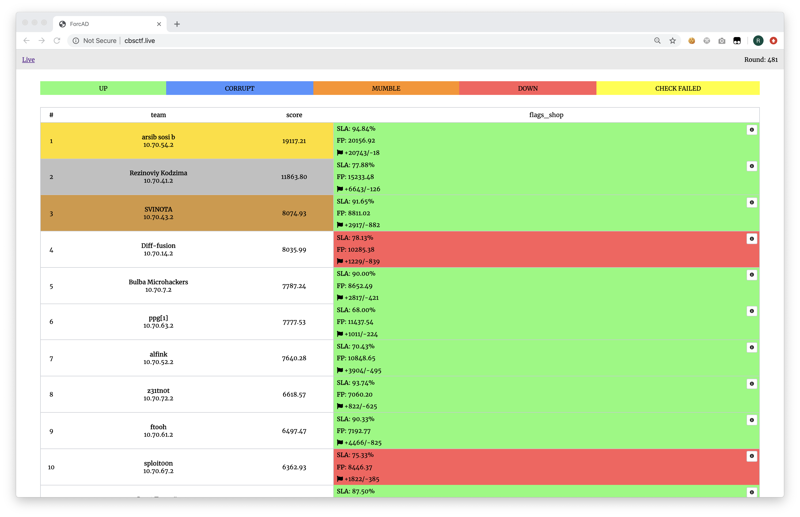

# Attack-Defence Blitz by C4T BuT S4D
Sources of services, checkers and sploits from 15th March 2020 blitz, **authored by [@lucky624](https://github.com/lucky624)**.

## Results

[Full scoreboard](scoreboard/full.png)

## Services

| Service | Lang | Checker | Sploits | Author |
|--------|------|-------|---------|-------|
| **[flags_shop](services/flags_shop/)** | Python | [Checker](checkers/flags_shop/) | [Sploits](sploits/flags_shop/) | [@lucky624](https://github.com/lucky624) |

## Infrastructure

- DevOps, infrastructure author: [@pomo-mondreganto](https://github.com/pomo-mondreganto).
- Checksystem: [ForcAD](https://github.com/pomo-mondreganto/ForcAD)
- special thanks to [@lucky624](https://github.com/lucky624) for the great service
